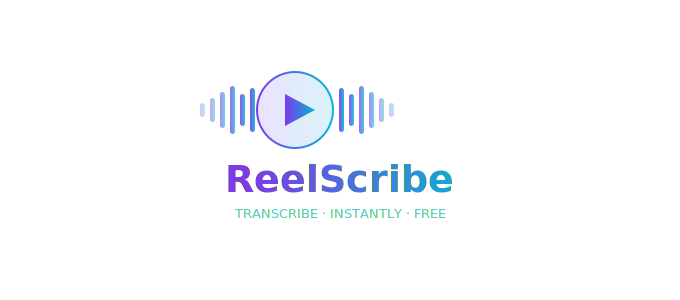

# 🎙️ ReelScribe

**ReelScribe** is a high-performance, open-source transcription tool designed to extract text from YouTube videos, Instagram Reels, TikToks, and local audio files in seconds. 

Built with a stunning **Glassmorphism UI** and powered by the latest AI models, it offers a fast, free, and account-free experience.



## ✨ Key Features

-   **High-Speed Transcription:** Powered by **Groq (Whisper large-v3-turbo)** for near-instant results.
-   **Smart Fallback:** Automatically switches to **Deepgram (Nova-2)** if Groq hits rate limits or is unavailable.
-   **Universal URL Support:** Transcribe directly from YouTube, Instagram Reels, and TikTok via `yt-dlp`.
-   **Local File Uploads:** Supports MP3, MP4, WAV, M4A, and WEBM.
-   **Interactive UI:** Dark/Light mode support with a modern, glassmorphic design.
-   **Rich Exports:** Export your transcripts as **TXT**, **SRT** (Subtitles), or **Markdown**.
-   **Live Editing:** Edit the transcription directly in the browser before exporting.

## 🛠️ Tech Stack

-   **Backend:** [FastAPI](https://fastapi.tiangolo.com/) (Python)
-   **Transcription:** [Groq AI](https://groq.com/) & [Deepgram](https://deepgram.com/)
-   **Web Extraction:** [yt-dlp](https://github.com/yt-dlp/yt-dlp)
-   **Frontend:** Vanilla JS + [Tailwind CSS](https://tailwindcss.com/)
-   **Styling:** Custom Glassmorphism CSS

## 🚀 Getting Started

### Prerequisites

-   **Python 3.11+**
-   **FFmpeg** (Required for audio extraction)
    -   *Linux:* `sudo apt update && sudo apt install ffmpeg`
    -   *macOS:* `brew install ffmpeg`
    -   *Windows:* `choco install ffmpeg`

### Installation

1.  **Clone the repository:**
    ```bash
    git clone https://github.com/yourusername/reelscribe.git
    cd reelscribe
    ```

2.  **Set up Virtual Environment:**
    ```bash
    python3 -m venv .venv
    source .venv/bin/activate  # Windows: .venv\Scripts\activate
    ```

3.  **Install Dependencies:**
    ```bash
    pip install -r backend/requirements.txt
    ```

4.  **Configure Environment Variables:**
    Create a `.env` file in the `backend/` directory:
    ```env
    GROQ_API_KEY=your_groq_key
    DEEPGRAM_API_KEY=your_deepgram_key
    ALLOWED_ORIGIN=http://localhost:8000
    ```

### Running Locally

```bash
cd backend
python3 -m uvicorn main:app --reload --port 8000
```
Open **[http://127.0.0.1:8000](http://127.0.0.1:8000)** in your browser.

## 📁 Project Structure

```text
reelscribe/
├── backend/            # FastAPI Backend
│   ├── main.py         # App entry & Routing
│   ├── services.py     # AI & Extraction logic
│   └── requirements.txt
├── frontend/           # Vanilla JS Frontend
│   ├── index.html
│   ├── style.css
│   └── script.js
├── reelscribe_logo.svg
└── README.md
```

## 📜 License

Distributed under the MIT License. See `LICENSE` for more information.

## 🙌 Credits

-   **Whisper AI** by OpenAI
-   **FFmpeg** for audio processing
-   **Groq Cloud** for inference speed
